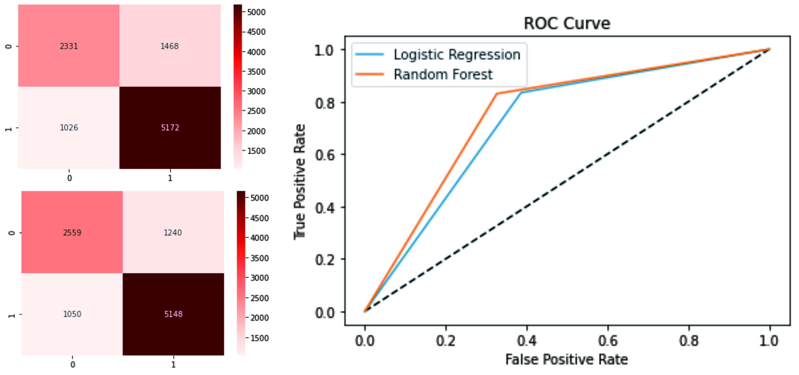

# Predict-Potentially-Subscribed-Users

## Project Overview
This project to determine the users who have potential to subscribe. The fintech company provides their premium application services for free for 24 hours. Some of the users subscribed immediately shortly after trying the trial service. In this case we target the user who meets the following conditions:
- try the trial service
- not subscribed
- potential to subscribe

I am performing comprehensive EDA on fintech dataset to understand important variables, feature engineering and ensembled machine learning models to predict the users who have potential to subscribe. The model used for this project is logistic regression and random forest.

## Data Overview

| User                 | Unique User ID                           |
|----------------------|------------------------------------------|
| First Open           | The First Time User Open The Application |
| Day of Week          | The Day of First Open                    |
| Hour                 | The Hour of First Open                   |
| Age                  | Age of User                              |
| Screen List          | Screens Opened by The User               |
| Numscreen            | Number of Screens Opened by The Users    |
| Minigame             | The Users who Play the Minigame Feature  |
| User Premium Feature | The Users who Using Premium Features     |
| Enrolled             | The Users who Enrolled                   |
| Enrolled Date        | The Date of User Subscribed              |
| Liked                | The Users who Like The Premium Feature   |

For Day of Week explanations:
| Day | Number    |
|-----|-----------|
| 0   | Sunday    |
| 1   | Monday    |
| 2   | Tuesday   |
| 3   | Wednesday |
| 4   | Thursday  |
| 5   | Friday    |
| 6   | Saturday  |

## Framework Steps

1. Data Preparation
2. Data Cleaning
3. EDA
4. Feature Engineering & Feature Scaling
5. Modeling
6. Evaluation

## Result
Using 2 models, this are the results of the evaluation of the matrix:
| Model               | Precision | Recall | F1-Scrore | Accuracy | ROC/AUC |
|---------------------|-----------|--------|-----------|----------|---------|
| Logistic Regression | 0.78      | 0.83   | 0.81      | 0.75     | 0.72    |
| Random Forest       | 0.81      | 0.83   | 0.82      | 0.77     | 0.75    |

